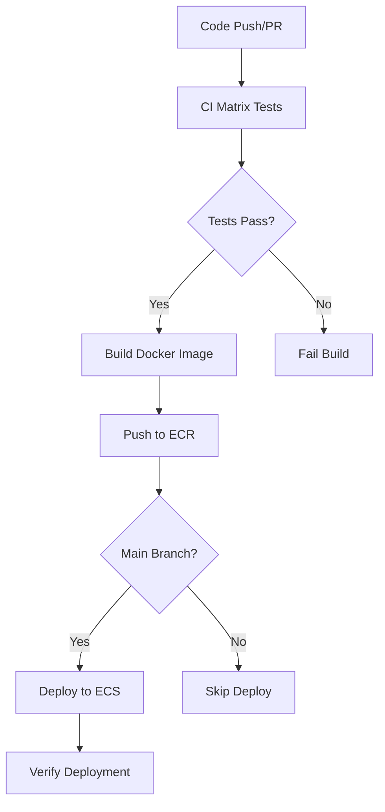

# CI/CD Pipeline Setup Guide

This guide explains how to set up the complete CI/CD pipeline for the Arabic Recognition App using GitHub Actions, Amazon ECR, and Amazon ECS.

## 🏗️ Pipeline Overview

The CI/CD pipeline consists of two main workflows:

1. **`ci-matrix.yml`** - Comprehensive testing with matrix strategies
2. **`build-deploy.yml`** - Build Docker images and deploy to production

### Pipeline Flow



## 🧪 CI Matrix Workflow Features

### Change Detection
- Detects changes in source code, Docker files, documentation, and workflows
- Runs only necessary tests based on changed files
- Optimizes build time and resource usage

### Testing Matrix
- **Package Validation**: Tests across Node.js 18 & 20 on Ubuntu, Windows, macOS
- **Docker Tests**: Tests multiple Docker Compose versions
- **Security Scanning**: npm audit and Docker image security scan with Trivy
- **Documentation**: Markdown lint and accuracy validation

### Test Categories
1. **Package Tests**: Dependency installation, server startup, endpoint testing
2. **Docker Tests**: Build, compose, health checks, integration testing
3. **Lint & Security**: Code quality, dependency audit, container security
4. **Documentation**: Markdown validation, Docker command verification

## 🚀 Build & Deploy Workflow Features

### Build Process
1. **Pre-build Validation**: Package structure and file existence checks
2. **Local Testing**: Docker build and container health checks
3. **Integration Testing**: Docker Compose full stack testing
4. **ECR Push**: Multi-tag image push (latest + version/branch tag)
5. **Security Scan**: Post-push image vulnerability assessment

### Deployment Process
1. **Task Definition Update**: Downloads current ECS task definition
2. **Image Update**: Updates task definition with new image URI
3. **ECS Deployment**: Deploys to specified cluster and service
4. **Verification**: Checks service stability and running counts
5. **Notification**: Deployment status and summary

## 🔧 AWS Infrastructure Setup

### Required AWS Resources

#### 1. ECR Repository
```bash
aws ecr create-repository \
  --repository-name arabic-recognition-app \
  --region us-east-1
```

#### 2. ECS Cluster
```bash
aws ecs create-cluster \
  --cluster-name arabic-recognition-cluster \
  --capacity-providers FARGATE \
  --default-capacity-provider-strategy capacityProvider=FARGATE,weight=1
```

#### 3. CloudWatch Log Group
```bash
aws logs create-log-group \
  --log-group-name /ecs/arabic-recognition-app \
  --region us-east-1
```

#### 4. IAM Roles

**ECS Task Execution Role**:
```json
{
  "Version": "2012-10-17",
  "Statement": [
    {
      "Effect": "Allow",
      "Principal": {
        "Service": "ecs-tasks.amazonaws.com"
      },
      "Action": "sts:AssumeRole"
    }
  ]
}
```

Attach policy: `arn:aws:iam::aws:policy/service-role/AmazonECSTaskExecutionRolePolicy`

**ECS Task Role** (for application permissions):
```json
{
  "Version": "2012-10-17",
  "Statement": [
    {
      "Effect": "Allow",
      "Principal": {
        "Service": "ecs-tasks.amazonaws.com"
      },
      "Action": "sts:AssumeRole"
    }
  ]
}
```

### 5. ECS Service Setup

#### Create Task Definition
```bash
# Update the template with your AWS account ID
sed 's/YOUR_ACCOUNT_ID/123456789012/g' .aws/task-definition-template.json > task-definition.json

# Register the task definition
aws ecs register-task-definition \
  --cli-input-json file://task-definition.json
```

#### Create ECS Service
```bash
aws ecs create-service \
  --cluster arabic-recognition-cluster \
  --service-name arabic-recognition-service \
  --task-definition arabic-recognition-task:1 \
  --desired-count 1 \
  --launch-type FARGATE \
  --network-configuration "awsvpcConfiguration={subnets=[subnet-12345,subnet-67890],securityGroups=[sg-abcdef],assignPublicIp=ENABLED}"
```

## 🔐 GitHub Secrets Setup

Configure the following secrets in your GitHub repository:

### Required Secrets
- `AWS_ACCESS_KEY_ID`: AWS IAM user access key with ECR and ECS permissions
- `AWS_SECRET_ACCESS_KEY`: AWS IAM user secret access key

### IAM Policy for GitHub Actions
```json
{
  "Version": "2012-10-17",
  "Statement": [
    {
      "Effect": "Allow",
      "Action": [
        "ecr:GetAuthorizationToken",
        "ecr:BatchCheckLayerAvailability",
        "ecr:GetDownloadUrlForLayer",
        "ecr:BatchGetImage",
        "ecr:InitiateLayerUpload",
        "ecr:UploadLayerPart",
        "ecr:CompleteLayerUpload",
        "ecr:PutImage"
      ],
      "Resource": "*"
    },
    {
      "Effect": "Allow",
      "Action": [
        "ecs:UpdateService",
        "ecs:DescribeServices",
        "ecs:DescribeTaskDefinition",
        "ecs:RegisterTaskDefinition"
      ],
      "Resource": "*"
    },
    {
      "Effect": "Allow",
      "Action": [
        "iam:PassRole"
      ],
      "Resource": [
        "arn:aws:iam::*:role/ecsTaskExecutionRole",
        "arn:aws:iam::*:role/ecsTaskRole"
      ]
    }
  ]
}
```

## 🎯 Workflow Configuration

### Environment Variables
Update these in `.github/workflows/build-deploy.yml`:

```yaml
env:
  ECR_REPOSITORY: arabic-recognition-app
  ECS_SERVICE: arabic-recognition-service  
  ECS_CLUSTER: arabic-recognition-cluster
  ECS_TASK_DEFINITION: arabic-recognition-task
  AWS_REGION: us-east-1
```

### Trigger Conditions

#### CI Matrix Workflow
- Runs on: Push to main/develop, PRs to main/develop, manual trigger
- Change detection: Only runs relevant tests based on file changes

#### Build & Deploy Workflow
- Builds on: All pushes and PRs
- Deploys on: Main branch pushes only
- Manual deploy: Available via workflow_dispatch

## 📊 Monitoring and Troubleshooting

### Build Logs
- Each workflow step provides detailed logs
- Docker build logs show container status
- Health check results are visible in logs

### Common Issues

#### 1. Docker Build Fails
```bash
# Check if package-lock.json exists
ls -la package-lock.json

# Regenerate if missing
npm install
```

#### 2. ECR Push Fails
- Verify AWS credentials are configured
- Check ECR repository exists
- Ensure IAM permissions for ECR

#### 3. ECS Deployment Fails
- Verify ECS cluster and service exist
- Check task definition is valid
- Ensure subnets and security groups are correct

#### 4. Health Check Fails
- Container may take time to start
- Check application logs in CloudWatch
- Verify port 3000 is accessible

### Monitoring Commands

```bash
# Check ECS service status
aws ecs describe-services \
  --cluster arabic-recognition-cluster \
  --services arabic-recognition-service

# View container logs
aws logs tail /ecs/arabic-recognition-app --follow

# Check task health
aws ecs describe-tasks \
  --cluster arabic-recognition-cluster \
  --tasks $(aws ecs list-tasks --cluster arabic-recognition-cluster --service-name arabic-recognition-service --query 'taskArns[0]' --output text)
```

## 🚦 Deployment Process

### Automatic Deployment (Main Branch)
1. Developer pushes to main branch
2. CI tests run and pass
3. Docker image builds and tests
4. Image pushes to ECR
5. ECS service updates with new image
6. Deployment verification runs
7. Success/failure notification

### Manual Deployment
```bash
# Trigger manual deployment
gh workflow run build-deploy.yml -f force_deploy=true
```

### Rollback Process
```bash
# List recent task definitions
aws ecs list-task-definitions --family-prefix arabic-recognition-task

# Rollback to previous version
aws ecs update-service \
  --cluster arabic-recognition-cluster \
  --service arabic-recognition-service \
  --task-definition arabic-recognition-task:PREVIOUS_REVISION
```

## 📈 Performance Optimization

### Build Optimization
- Matrix strategy runs tests in parallel
- Change detection skips unnecessary tests
- Docker layer caching speeds up builds
- Multi-stage builds reduce image size

### Deployment Optimization
- Health checks ensure zero-downtime deployment
- Service stability checks prevent failed deployments
- Automated rollback on deployment failure

## 🔒 Security Features

### Container Security
- Non-root user execution
- Minimal Alpine Linux base image
- Regular security scanning with Trivy
- npm audit for dependency vulnerabilities

### AWS Security
- IAM roles with least privilege
- ECR image scanning
- CloudWatch logging for audit trail
- VPC networking for isolation

---

This CI/CD pipeline provides a robust, secure, and automated deployment process for the Arabic Recognition App with comprehensive testing and monitoring capabilities.
