# CI/CD Pipeline Summary

## 📁 Files Created

### GitHub Workflows
- `.github/workflows/ci-matrix.yml` - Comprehensive testing with matrix strategies
- `.github/workflows/build-deploy.yml` - Build and deployment pipeline
- `.github/workflows/README.md` - Workflow documentation

### AWS Configuration
- `.aws/task-definition-template.json` - ECS task definition template
- `scripts/setup-aws-infrastructure.sh` - AWS infrastructure setup script

### Documentation
- `docs/cicd-setup.md` - Complete CI/CD setup guide

## 🚀 Pipeline Features

### CI Matrix Workflow (`ci-matrix.yml`)
✅ **Change Detection**
- Detects changes in source, Docker, docs, and workflows
- Runs only necessary tests to optimize build time

✅ **Matrix Testing**
- Node.js versions: 18, 20
- Operating systems: Ubuntu, Windows, macOS
- Docker Compose versions: 2.20.0, latest

✅ **Comprehensive Testing**
- Package validation and server startup tests
- Docker build and compose integration tests
- Security scanning with npm audit and Trivy
- Documentation validation with markdownlint

✅ **Smart Execution**
- Parallel job execution for faster builds
- Conditional job execution based on file changes
- Detailed test result summaries

### Build & Deploy Workflow (`build-deploy.yml`)
✅ **Build Process**
- Pre-build validation and dependency checks
- Local Docker testing with health checks
- Docker Compose integration testing
- Multi-tag ECR image push (latest + version)

✅ **Deployment Process** (Main branch only)
- ECS task definition updates
- Zero-downtime service deployment
- Deployment verification and health checks
- Automatic rollback on failure

✅ **Security & Quality**
- Container vulnerability scanning
- Image security analysis
- Deployment status notifications

## 🏗️ Infrastructure Requirements

### AWS Resources
- **ECR Repository**: `arabic-recognition-app`
- **ECS Cluster**: `arabic-recognition-cluster`
- **ECS Service**: `arabic-recognition-service`
- **CloudWatch Log Group**: `/ecs/arabic-recognition-app`
- **IAM Roles**: `ecsTaskExecutionRole`, `ecsTaskRole`

### GitHub Secrets
- `AWS_ACCESS_KEY_ID`: AWS access key for ECR/ECS operations
- `AWS_SECRET_ACCESS_KEY`: AWS secret key for ECR/ECS operations

## 🔄 Workflow Triggers

### CI Matrix Tests
- ✅ Push to `main` or `develop` branches
- ✅ Pull requests to `main` or `develop` branches  
- ✅ Manual trigger via GitHub Actions UI

### Build & Deploy
- ✅ Push to `main` branch → Build + Deploy
- ✅ Push to other branches → Build only
- ✅ Pull requests → Build only
- ✅ Manual trigger with optional forced deployment

## 📊 Testing Strategy

### Matrix Combinations
- **3 Operating Systems** × **2 Node.js Versions** = **6 Package Test Combinations**
- **2 Docker Compose Versions** = **2 Docker Test Combinations**
- **Security Scanning** on all builds
- **Documentation Validation** on doc changes

### Test Categories
1. **Package Tests**: Dependencies, server startup, endpoint validation
2. **Docker Tests**: Build, compose, health checks, integration
3. **Security Tests**: npm audit, container scanning, vulnerability assessment
4. **Documentation Tests**: Markdown linting, accuracy validation

## 🚀 Deployment Flow

```mermaid
graph TD
    A[Push to Main] --> B[CI Matrix Tests]
    B --> C{All Tests Pass?}
    C -->|Yes| D[Build Docker Image]
    C -->|No| E[❌ Fail Build]
    D --> F[Local Testing]
    F --> G[Docker Compose Test]
    G --> H[Push to ECR]
    H --> I[Update ECS Task Definition]
    I --> J[Deploy to ECS]
    J --> K[Health Check]
    K --> L{Deployment Success?}
    L -->|Yes| M[✅ Success Notification]
    L -->|No| N[❌ Rollback & Notify]
```



## ⚡ Quick Setup

### 1. AWS Infrastructure
```bash
# Run the setup script
./scripts/setup-aws-infrastructure.sh
```

### 2. GitHub Configuration
```bash
# Add AWS credentials to GitHub secrets
# AWS_ACCESS_KEY_ID
# AWS_SECRET_ACCESS_KEY
```

### 3. Deploy
```bash
# Push to main branch to trigger deployment
git add .
git commit -m "Add CI/CD pipeline"
git push origin main
```

## 🔧 Customization Options

### Modify Testing Matrix
```yaml
# In ci-matrix.yml
strategy:
  matrix:
    node-version: [18, 20, 22]  # Add Node.js 22
    os: [ubuntu-latest, windows-latest, macos-latest]
```

### Update AWS Configuration
```yaml
# In build-deploy.yml
env:
  ECR_REPOSITORY: your-app-name
  ECS_SERVICE: your-service-name
  ECS_CLUSTER: your-cluster-name
  AWS_REGION: your-region
```

### Add Additional Tests
```yaml
# Add new job to ci-matrix.yml
performance-tests:
  runs-on: ubuntu-latest
  steps:
    - name: Load Testing
      run: # Your load testing commands
```

## 📈 Benefits

### Development Efficiency
- ⚡ **Parallel Testing**: Matrix strategy runs tests concurrently
- 🎯 **Smart Testing**: Only runs relevant tests based on changes
- 🔄 **Fast Feedback**: Quick identification of issues

### Deployment Reliability
- 🛡️ **Zero Downtime**: ECS rolling deployments
- ✅ **Health Checks**: Automated deployment verification
- 🔙 **Rollback**: Automatic rollback on deployment failure

### Security & Quality
- 🔍 **Vulnerability Scanning**: Container and dependency scanning
- 📊 **Code Quality**: Linting and syntax validation
- 🚨 **Security Alerts**: Integration with GitHub Security tab

### Monitoring & Observability
- 📋 **Detailed Logs**: Comprehensive logging at each step
- 📊 **Test Summaries**: Clear result reporting
- 🔔 **Notifications**: Deployment status updates

## 🎯 Next Steps

1. **Test the Pipeline**: Push changes to trigger workflows
2. **Monitor Deployments**: Check ECS service and CloudWatch logs
3. **Optimize Performance**: Adjust resource limits based on usage
4. **Scale**: Add load balancer and auto-scaling as needed
5. **Enhance Security**: Add additional security scanning tools

---

This CI/CD pipeline provides a production-ready, secure, and scalable deployment solution for the Arabic Recognition App with comprehensive testing and monitoring capabilities.
